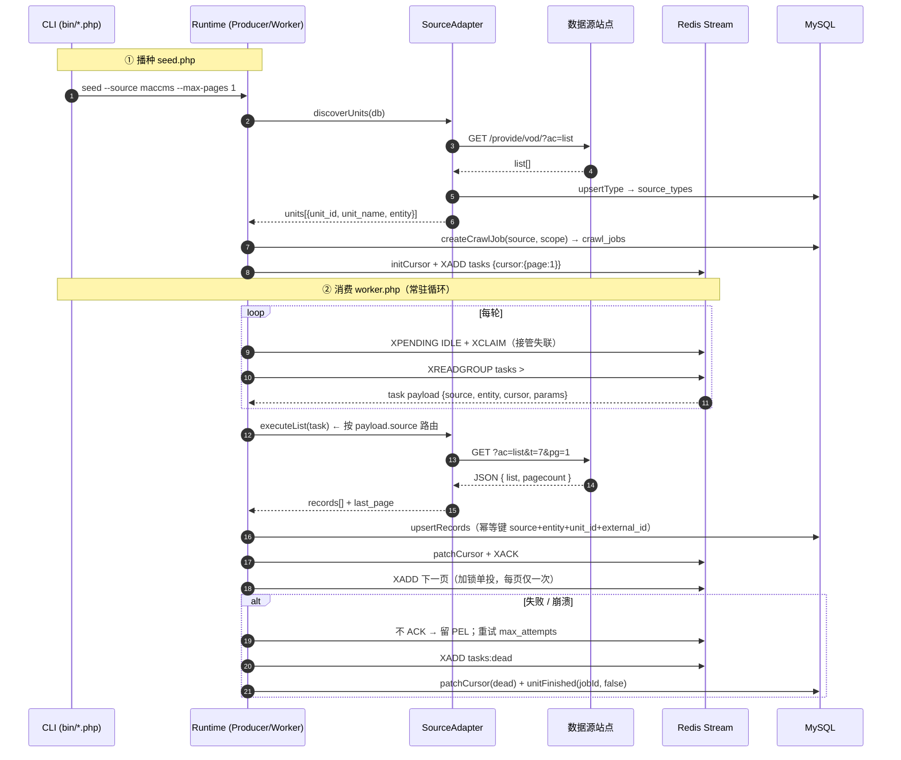

# crawl-worker-redis（PHP CLI 采集 Worker · Redis Stream 版 · 多源架构）

> 作品集中的一个「真实站点采集」子项目：以常驻 PHP 进程 + Redis Stream 消费组
> 实现一个**数据源无关**的可断点续采 / 崩溃恢复 / 失败重试 / 死信隔离的
> 采集器。已落地的两个真实数据源：
> - **shikues**（电子元器件站，产品目录接口）
> - **maccms**（影视资源站，MacCMS V10 官方 `provide/vod` JSON 接口）
>
> 同一套 Runtime（Producer / Worker / RedisStore / Db）消费两个源，写入同一套
> 通用结果表 `crawl_jobs / crawl_records`，**零数据源分支**。
>
> 可视化配图：`architecture.html`（分层架构）、`crawl-flow.html`（采集流程）、
> `sequence.html`（Runtime ↔ Adapter ↔ Redis / MySQL 时序图）。

---

## 一、解决什么问题 / 设计动机

普通 MySQL 版任务表方案在**高并发分片、断点续采、重复投递**上要自己实现很多
细节（锁表、游标、扫描轮询……）。Redis Stream 天然提供：

| 要解决的问题 | Redis 方案 | 代码体现 |
| --- | --- | --- |
| 任务排队与公平消费 | `XADD` 追加 + 消费组 `XREADGROUP` | `RedisStore::addTask / readBatch` |
| 横向扩容（多 Worker） | 同组多个 consumer，消息不重复投递 | 开多个 `bin/worker.php --name wX` |
| 崩溃恢复 / 断点续采 | 未 ACK 消息留在 PEL，超时后接管重投 | `XPENDING IDLE + XCLAIM` 接管 |
| 失败重试 | 失败不 ACK → 按 `claim_idle` 周期自动重试 | `Worker::onFail` |
| 垃圾/毒丸任务 | 超 max_attempts 转死信流 | `tasks:dead` + `bin/stats.php` 可查 |
| 每采集单元进度 | 游标 Hash（done_pages/total_pages/status） | `cur:{source}:{entity}:{unit_id}` |
| 结果幂等 | MySQL `(source, entity, unit_id, external_id)` 唯一键 upsert | `Db::upsertRecords` |
| **数据源无关** | `SourceAdapter` 契约 + `AdapterRegistry` 路由 | `Worker::run` 仅 `payload.source` 一处分派 |

**分层（数据源无关后的两层）**

```
┌───────────── 任务层(Redis) ─────────────┐   ┌────────── 结果层(MySQL) ──────────┐
│ Stream:  tasks        = 待抓页码任务      │   │ source_types   采集单元目录        │
│         tasks:dead    = 死信             │   │ crawl_jobs     跨源统一作业         │
│ Hash:  cur:{src}:{ent}:{unit_id}        │   │ crawl_records  跨源 Canonical Record│
│         stats         = 全局计数         │   │   (payload_json + raw_json)       │
│         attempt:{msgId} = 消息重试次数   │   └──────────────────────────────────┘
└─────────────────────────────────────────┘
```

数据源差异**全部收敛在 Adapter 层**，Runtime 不感知。

---

## 二、目录结构

```
crawl-worker-redis/
├─ bin/
│  ├─ init_db.php   初始化 MySQL 库表（幂等 + 旧 source_types 一次性迁移）
│  ├─ seed.php      播种：发现采集单元 → 写元数据 → 投首页任务
│  │                 --source <shikues|maccms>  --units <id,...>  --max-pages N
│  ├─ worker.php    常驻消费 Worker（可多开，跨源）
│  ├─ stats.php     任务层+结果层运行总览（支持 --source 过滤）
│  └─ reset.php     清空 Redis 任务层（演示重跑用，不影响 MySQL）
├─ config/config.php  统一配置（MySQL/Redis/Http/sources，支持环境变量覆盖）
├─ deploy/supervisor/crawl-worker.conf  supervisor 守护多进程示例（Linux）
├─ sql/schema.sql     MySQL 表结构
├─ src/
│  ├─ bootstrap.php   autoload + CLI 参数解析 + schema 应用
│  ├─ Http.php / Db.php / Logger.php / ProxyPool.php / ProxyException.php
│  ├─ RedisStore.php  Stream/消费组/游标/接管/统计封装
│  ├─ Producer.php    播种逻辑（通用，按 source 路由）
│  ├─ Worker.php      消费主循环与失败语义（通用，按 source 路由）
│  ├─ Contract/
│  │   ├─ SourceAdapter.php   采集源契约：discoverUnits + executeList
│  │   └─ Task.php            通用任务模型（source/entity/operation/cursor/...）
│  └─ Adapter/
│     ├─ ShikuesAdapter.php   shikues 数据源实现
│     ├─ MacCmsAdapter.php    maccms (MacCMS V10) 数据源实现
│     ├─ AdapterFactory.php   按 source 字符串构造具体 Adapter
│     └─ AdapterRegistry.php  Worker/Producer 持有，按 source 取 Adapter
├─ samples/env_test.php  环境连通性自检
├─ tests/
│  ├─ smoke.php        冒烟/回归（离线，A/B/C + Worker 全链路）
│  └─ multisource.php  双源端到端：同 Stream 混跑 shikues+maccms、断言 Runtime 零分支
├─ 多进程高并发解决方案.md  多进程水平扩容方案
└─ logs/               运行日志（worker.log / seed.log）
```

---

## 三、环境要求

- PHP 8.0+（CLI），扩展：`redis`、`curl`、`pdo_mysql`、`dom`
- Redis 6.2+（接管机制用到 `XPENDING ... IDLE` 过滤）
- MySQL 5.7+ / 8.0
- 能访问至少一个数据源（shikues 站点 / maccms 采集站）

> 环境自检：`php samples/env_test.php`。

---

## 四、Source Definition（数据源配置驱动）

每个数据源在 `config/config.php` 的 `sources` 段声明，**Runtime 不感知差异**，
差异由对应 Adapter 实现。

```php
'sources' => [
    'shikues' => [
        'adapter'  => 'shikues',
        'site'     => 'https://www.shikues.com',
        'api_base' => '...',
        'type'     => 1,
        'entity'   => 'model',
    ],
    'maccms' => [
        'adapter'  => 'maccms',
        'site'     => 'https://cj.lziapi.com',
        'api_base' => 'https://cj.lziapi.com/api.php/provide/vod/',
        'entity'   => 'vod',
        'page_size'=> 20,
        'units'    => [
            ['unit_id' => 7,  'unit_name' => '喜剧片'],
            ['unit_id' => 15, 'unit_name' => '韩国剧'],
            ['unit_id' => 30, 'unit_name' => '日韩动漫'],
        ],
        'detail_url' => '/api.php/provide/vod/?ac=detail&ids={id}',
    ],
],
```

**SourceAdapter 契约**（`src/Contract/SourceAdapter.php`）：

```php
interface SourceAdapter {
    public function source(): string;                  // 标识：shikues / maccms
    /** 启动时发现本源的采集单元（系列/分类），返回 [{unit_id,unit_name,entity}] */
    public function discoverUnits(Db $db): array;
    /** 执行一个分页抓取：返回 ['rows'=>[Canonical...], 'total_pages'=>N, 'next_page'=>?int] */
    public function executeList(string $unitId, int $page, array $params): array;
}
```

> 接第三个源：实现一个 `XxxAdapter implements SourceAdapter` + 在
> `AdapterFactory` 加一个 `case` + `sources` 加一段配置。
> （flag.md §6 目标是把 case 也去掉，做成纯配置驱动；当前已具备双源端到端闭环，
> 真正零代码接入是下一阶段工作。）

---

## 五、快速开始

### 5.1 初始化

```bash
php bin/init_db.php
# MySQL 连接成功，库: shikues_crawler
# Schema OK（表不存在则已自动创建）
# [init_db] 迁移: 遗留 source_types(12 行) 已 drop 并按 schema.sql 重建为通用表
# -------- 通用层（跨数据源） --------
# crawl_jobs    = 0
# crawl_records = 0
```

> `init_db` 内置**一次性迁移**：旧 `source_types`（id PK + `type_name`/`type_name_en`，
> shikues 特化）会按 `schema.sql` 重建为 `(source,type_id)` 复合主键 +
> `cn_name`/`en_name` 的跨源通用表；旧数据可由 shikues 重新 seed 恢复。

### 5.2 真实采集演示 A：shikues（电子元器件）

```bash
php bin/seed.php --source shikues --max-pages 3
php bin/worker.php --idle-rounds 0    # 可开多个终端模拟横向扩容
php bin/stats.php --source shikues --recent 5
```

实跑样例（2026-09-05 本机）：

```
[2026-09-05 11:37:04] INFO [1] p1/3 Low VF肖特基二极管(CLAIM) 写入 15 行，游标 page=1 total=3 rows=15
[2026-09-05 11:37:14] INFO [1] p2/3 Low VF肖特基二极管(NEW)  写入 15 行，游标 page=2 total=3 rows=30
[最终状态] dead_letters=0 page_done=27 pending=0 rows_upsert=376 stream_len=27
[MySQL] source_types=12 product_models=419
```

### 5.3 真实采集演示 B：maccms（影视资源站，MacCMS V10）

数据源：采集站 `cj.lziapi.com`（MacCMS V10 官方 `api.php/provide/vod` JSON 接口）。
三个真实分类：`t=7 喜剧片` / `t=15 韩国剧` / `t=30 日韩动漫`（实测自该站）。

```bash
php bin/reset.php                                     # 清任务层（不影响 MySQL）
php bin/seed.php --source maccms --max-pages 1        # 3 个分类各投首页
php bin/worker.php --idle-rounds 2 --name wmaccms
php bin/stats.php --source maccms
```

实跑样例（2026-09-10 本机）：

```
[seed]  本轮播种 [maccms] 共 3 个采集单元（job=job-20260910160205-42726c, max_pages=1）
[seed]  [maccms|韩国剧|p1]   已投递首页任务 ...
[seed]  [maccms|日韩动漫|p1] 已投递首页任务 ...
[seed]  [maccms|喜剧片|p1]   已投递首页任务 ...

[worker wmaccms2]
[maccms|韩国剧|p1]   p1/90  NEW  写入 20 行，游标 page=1 total=90  rows=20  [END]
[maccms|日韩动漫|p1] p1/214 NEW  写入 20 行，游标 page=1 total=214 rows=20  [END]
[maccms|喜剧片|p1]   p1/387 NEW  写入 20 行，游标 page=1 total=387 rows=20  [END]
[最终状态] dead_letters=0 page_done=3 pending=0 rows_upsert=60 seeded_units=3 stream_len=3
[MySQL] crawl_jobs=2 crawl_records=60

[stats --source maccms]
 任务流长度 : 3   PEL 未确认 : 0   死信流长度 : 0
 统计: {"seeded_units":"3","page_done":"3","rows_upsert":"60"}
 crawl_jobs=2  crawl_records=60
   maccms  vod  rows=60
 ---- 最近作业 ----
   job-...  source=maccms  status=done  units=3/3 done  records=60
       scope=[{entity:vod,unit_id:15,unit_name:韩国剧},
              {entity:vod,unit_id:30,unit_name:日韩动漫},
              {entity:vod,unit_id:7, unit_name:喜剧片}]
 ---- 最近落库 Canonical Record ----
   maccms | vod | 韩国剧 | 151415 | 欲望的陷阱2026
      payload: {"type_id":"15","vod_name":"欲望的陷阱2026","vod_time":"...","type_name":"韩国剧","vod_remarks":"HD"}
   maccms | vod | 韩国剧 | 156829 | 中头奖还是要上班
   maccms | vod | 韩国剧 | 132528 | 我们愉快的好日子
```

**注意点**：
- MacCMS `ac=list` 是**精简字段**（`vod_id` / `vod_name` / `type_id` / `type_name` /
  `vod_en` / `vod_time` / `vod_remarks` / `vod_play_from`），没有图片/年份；
  完整字段需 `ac=detail`，已在 `payload_json` 中按需增加。
- 采集站前端 HTML 普遍被 UA 拦截（403），所以 `detail_url` 默认指向
  `api.php/provide/vod/?ac=detail&ids={id}`（API 详情可点开验证）；
  若换成有可访问前端的源，把 `detail_url` 改回 `/index.php/vod/detail/id/{id}.html`。
- 写库幂等键 `(source, entity, unit_id, external_id)`：多次重采同一分页
  不会重复入库（`ON DUPLICATE KEY UPDATE`）。

### 5.4 多源混跑

`worker.php` 不带 `--source` 即**跨源消费**——同一消费组里 shikues 与 maccms
任务可任意穿插（由 Redis Stream 自然按到达顺序 + `XREADGROUP` 公平派发）。
若想分源跑，开多组 `bin/worker.php --name w-shikues / w-maccms` 即可。
离线双源端到端测试：

```bash
php tests/multisource.php
```

### 5.5 一次采集的完整时序（Runtime ↔ Adapter ↔ Redis / MySQL）



> **数据源无关的分派点**：Runtime 仅在 `adapters->get($payload['source'])` 一处选择 Adapter，
> 之后抓取 / 解析 / 字段映射全在 Adapter 内完成，统一返回 `records[] + last_page`。
> 完整可交互版（含崩溃恢复接管时序）见 `sequence.html`。

---

## 六、可靠性演示（评审用）

> 与早期版本同语义，下面以 shikues 演示；maccms 同理适用。

**A. 崩溃恢复（XCLAIM 接管）**—— 模拟 Worker 处理中被 kill：

```bash
php bin/reset.php
php bin/seed.php --source shikues --types 1,3,4,6,8,9,10,11,12,13 --max-pages 3
# PowerShell：后台 worker，读走一批后强杀
$p = Start-Process php -ArgumentList 'bin/worker.php','--name','wb','--idle-rounds','0' -PassThru
Start-Sleep -Milliseconds 4000
Stop-Process -Id $p.Id -Force
php bin/stats.php     # PEL 未确认 > 0
php bin/worker.php --name w2 --idle-rounds 0   # 新 consumer 自动接管
php bin/stats.php     # PEL 归 0，MySQL 不重不漏
```

接管不依赖 `XAUTOCLAIM`，用 `XPENDING IDLE + XCLAIM` 等价实现，兼容老版本 Redis。
演示小技巧：设 `CW_CLAIM_IDLE_MS=3000` 把接管阈值缩到 3s 可快速复现。

**B. 失败重试与死信**—— 临时断网/接口 5xx：失败消息不 ACK 留在 PEL，
每 `claim_idle` 自动重试，超过 `max_attempts`(3) 转入 `tasks:dead`，
`stats.php` 中 `dead_letters` 可观测。

**C. 幂等重采**—— 重跑不重复入库：

```bash
php bin/seed.php --source shikues --types 1,3,4 --max-pages 3 --force
php bin/worker.php --name w1 --idle-rounds 5
php bin/stats.php     # product_models 数量不变
```

---

## 七、配置与生产化建议

- 所有环境相关项集中 `config/config.php`，支持环境变量覆盖
  （`CW_MYSQL_*` / `CW_REDIS_HOST` / `CW_REDIS_PORT` / `CW_REDIS_AUTH` /
  `CW_SOURCE` / `CW_MACCMS_*` / `CW_MAX_PAGES` / `CW_CA_BUNDLE` 等）。
- ⚠️ 仓库配置默认指向本机 `127.0.0.1:6379`（无密码），**不存放任何真实 Redis
  连接凭据**；远程 Redis 通过 `CW_REDIS_HOST` / `CW_REDIS_AUTH` 注入。
- 生产 HTTPS 证书：设置 `CW_CA_BUNDLE`；本机 phpstudy 等缺系统 CA 时按
  `insecure_fallback` 降级（仅限本地/演示）。
- 常驻部署：`php bin/worker.php --idle-rounds 0`，用 Supervisor / NSSM /
  Windows 计划任务守护，进程数 = 消费能力，靠消费组天然负载均衡。
  > 多进程高并发详细方案见《多进程高并发解决方案.md》，
  > 托管示例见 `deploy/supervisor/crawl-worker.conf`。

---

## 八、本机运行备注（Windows）

项目位于无中文目录 `E:\workspace\phpworkspace\crawl-worker-redis`，
可直接在 cmd/PowerShell 运行：

```powershell
cd E:\workspace\phpworkspace\crawl-worker-redis
php bin\seed.php --source maccms --max-pages 1
php bin\worker.php --idle-rounds 2 --name w1
php bin\stats.php --source maccms
```

---

## 九、测试

```bash
php tests/smoke.php             # 离线全量冒烟：环境 + 任务层 + 幂等 + Worker 失败语义
php tests/smoke.php --no-worker  # 只跑 A/B/C（<1s）
php tests/multisource.php        # 双源端到端：同 Stream 混跑、断言 Runtime 零分支
```

`tests/multisource.php` 关键断言：
- 同一 `tasks` Stream 同时存在 `source=shikues` 与 `source=maccms` 的任务；
- 同一 `Worker` 一次循环里两类任务都能消费成功，零数据源分支；
- 各自 `crawl_jobs` / `crawl_records` 独立行（同源不互串）。

> `exit code`：全部通过 0，有失败 1，执行异常 2，便于接入 CI。
