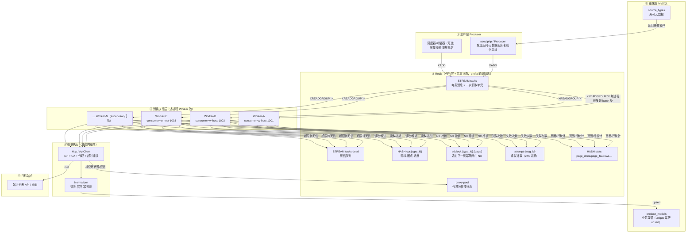
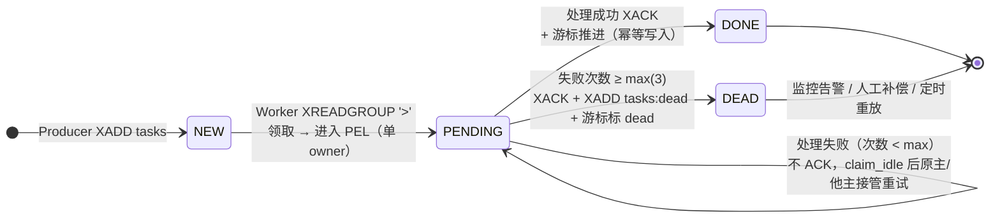
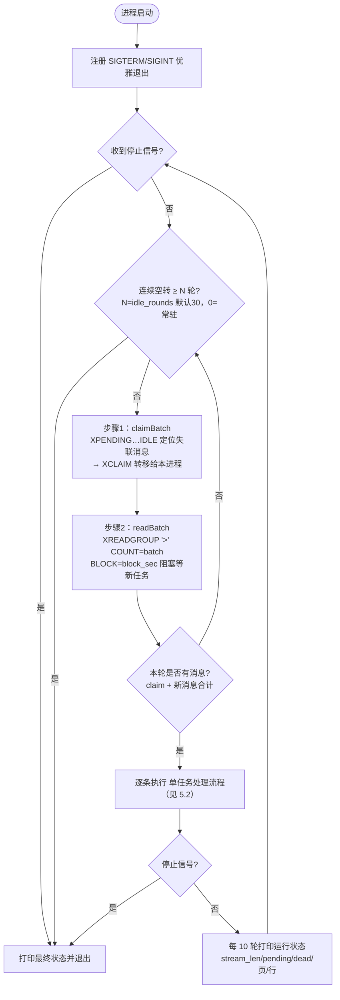
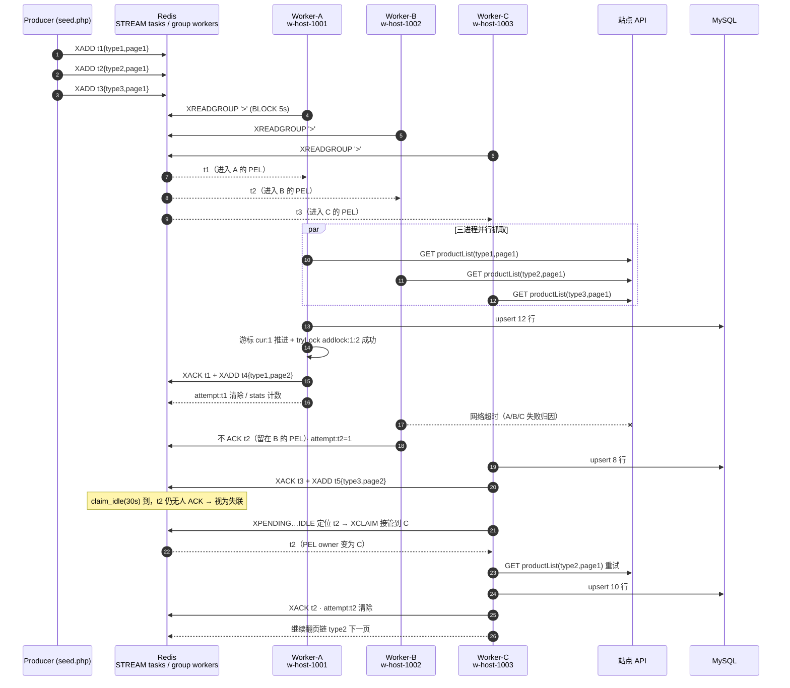
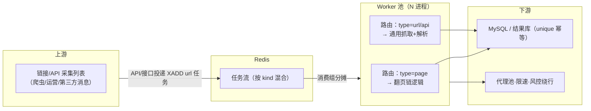

# 多进程队列采集方案（实例流程图）

> 面向“采集 API / 链接”类任务：上游把一次抓取动作（列表 API 请求 / 具体页面链接）建模为**一条队列消息**，
> 下游由 **N 个 Worker 进程**并发消费。本文描述该体系内的架构、队列机制与实例流程图，不改代码。

---

## 1. 背景与目标

- 采集动作 = 一次 HTTP 请求（如 `GET productList?type_id=1&page=2&limit=15`），可被独立派发、独立完成、独立失败。
- 用 **Redis Stream + 消费组** 做任务队列，天然支持：
  - 同一消息只被组内**一个** consumer 领取（无需业务层抢锁）；
  - 失败消息留在 PEL，超时被其他进程 **接管重试**（崩溃恢复）；
  - 尝试超限转入**死信流**，可观测、可补偿。
- Worker 之间**无共享内存、无主从关系**，是同一消费组下地位平等的进程；并行度 = `进程数 × 每进程吞吐`。

---

## 2. 核心模型：一条任务消息

队列消息体统一为 Stream 的 `p` 字段（JSON 字符串）：

| 字段 | 含义 | 示例 |
|---|---|---|
| `type` | 任务类型（路由用） | `page`（当前实现）；演进可加 `url` / `api` |
| `type_id` | 业务系列 / 资源 ID | `1` |
| `page` | 页码（分页抓取单元） | `2` |
| `type_name` | 系列名（冗余，便于日志/游标自愈） | `电阻` |
| （演进）`url` | 待抓链接 / API 全址 | `https://.../productList?...` |
| （演进）`parser`/`ctx` | 解析器标识、业务上下文 | `list` / `{"cat":"3"}` |

> 一条消息 = 一次“可独立完成的抓取单元”。把**链接/API**放进消息而不是写死在进程里，
> 是队列化消费的第一步——生产与消费彻底解耦。

---

## 3. 总体架构



各组件在代码中的对应：

| 职责 | 实现 | 说明 |
|---|---|---|
| 生产/播种 | `Producer` + `bin/seed.php` | 发现系列 → 建游标 → XADD 首页任务 |
| 队列与状态 | `RedisStore` | addTask / readBatch / claimBatch / ack / 游标 / 尝试计数 / 统计 |
| 常驻消费 | `Worker` + `bin/worker.php` | 主循环 = claim 接管 + 阻塞读 + 逐条处理 |
| HTTP 抓取 | `Http` / `ApiClient` | 失败归因 A/B/C；代理池可开关 |
| 结果层 | `Db`（`product_models` unique upsert） | 与任务层解耦，天然幂等 |

---

## 4. 队列机制与消息生命周期

Redis 消费组语义（group = `workers`）：

- **NEW**：Producer `XADD` 进 `tasks`；
- **PENDING**：Worker `XREADGROUP '>'` 领取后消息进入该 consumer 的 **PEL**（Pending Entries List，处理中列表），此时它是该 consumer 的“私有 in-flight”；
- **DONE**：处理成功 `XACK` → 从 PEL 移除，任务终结；
- **重试**：处理失败**不 ACK** → 消息留在 PEL；超过 `claim_idle`(默认 30s) 仍未被确认，即视为“失联”，任意 Worker 用 `XPENDING IDLE + XCLAIM` 把它**接管**重新处理；
- **DEAD**：接管重试次数达到 `max_attempts`(默认 3) → `XACK` 后写入死信流 `tasks:dead`，游标标 `dead`。



Redis 关键 Key（均带前缀，如 `cw:shikues:`）：

| Key | 类型 | 作用 | 谁写 | 谁读 |
|---|---|---|---|---|
| `tasks` | STREAM | 任务队列（MAXLEN≈5000 防演示期无限增长） | Producer/Worker 追加下一页 | 全部 Worker |
| `tasks:dead` | STREAM | 死信 | Worker（超限） | 监控/补偿 |
| `cur:{type_id}` | HASH | 游标：status / done_pages / rows | 消费推进 | 消费前断点守卫、Producer 去重 |
| `addlock:{type_id}:{page}` | STRING NX | 追加下一页闸门（防并发重复投递） | 翻页成功者 | 同上 |
| `attempt:{msg_id}` | STRING | 该消息累计失败次数（24h） | 失败时 INCR | 超限判定 |
| `stats` | HASH | page_done/page_fail/rows 等 | Worker | 日志/监控 |
| `proxy:pool` | 多键 | 代理健康（Redis 化，多进程共享） | Http | Http |

---

## 5. 实例流程图

### 5.1 Worker 实例主循环（单进程视角）

`bin/worker.php` 每个进程独立运行同一主循环；`consumer` 名缺省为 `w-{主机名}-{pid}`，**进程间天然不重名**。



### 5.2 单任务处理流程（一次抓取单元的完整生命周期）

```mermaid
flowchart TD
    M([收到消息 msg_id + payload])
    M --> V{载荷合法?<br/>type=page 且 type_id/page>0}
    V -->|否| D1[XACK + 写死信<br/>非法任务载荷]
    V -->|是| C0{游标 cur:{type_id} 存在?}
    C0 -->|否| HEAL[initCursor 自愈补建游标]
    HEAL --> C1
    C0 -->|是| C1
    C1{page ≤ done_pages?<br/>重复投递/已被本系列完成}
    C1 -->|是| ACKDUP[XACK 直接确认 · 幂等去重]
    C1 -->|否| TRY["抓取：GET 列表 API<br/>type_id + page + limit<br/>（代理池/UA/超时/请求内重试）"]
    TRY -->|成功| PARSE["Normalizer 清洗展平为 rows"]
    PARSE --> UP["MySQL upsert product_models<br/>unique 幂等"]
    UP --> LAST{page ≥ last_page<br/>或 ≥ max_pages?}
    LAST -->|是| CT[游标置 done<br/>推进 done_pages/rows]
    LAST -->|否| CA[游标置 active<br/>推进 done_pages/rows]
    CA --> NL{tryLockNextPage NX<br/>addlock:{type_id}:{page+1} 抢到?}
    NL -->|是| NX[XADD 投递下一页任务<br/>{type_id, page+1}]
    NL -->|否| GOT[他人已投递 · 跳过]
    CT --> ACK[XACK + 清 attempt + stats 计数]
    NX --> ACK
    GOT --> ACK
    TRY -->|"失败(网络/风控/业务)"| FAIL["bumpAttempt: attempt 计数+1<br/>page_fail 计数+1"]
    FAIL --> MX{attempt ≥ max_attempts?}
    MX -->|否| WAIT[不 XACK · 留在 PEL<br/>claim_idle 后原主/他主接管重试]
    MX -->|是| D2[XACK + XADD tasks:dead<br/>+ 游标置 dead]
    D1 --> T1([本条终结])
    ACKDUP --> T1
    WAIT --> T1
    D2 --> T1
    ACK --> T1
```

### 5.3 三个 Worker 并发消费实例（时序图）

演示：三个进程同时各领一条消息；Worker-B 抓取失败 → 消息不 ACK 留 PEL；30s 后被 Worker-C 接管重试成功。



> 关键观察：消息 **t1/t2/t3 互不等待** → 并行度来自“不同任务”横向扩展；
> t2 失败不阻塞任何人 → 靠 PEL + claim 实现**异步重试/崩溃恢复**；
> t1 成功后投递的 t4 也回队，整条翻页链随队列自然流转。

---

## 6. 一致性设计（为什么不会重复/丢任务）

| 威胁 | 防线 | 机制 |
|---|---|---|
| 进程崩在“抓取后、落库前” | at-least-once + 幂等 | 不 ACK → 消息留 PEL → 接管后重放；MySQL `unique` upsert 幂等，重放不产生脏数据 |
| 队列重投/消息重复 | 游标断点守卫 | 处理前比对 `page ≤ done_pages`，已完成的直接 XACK 丢弃 |
| 两个进程同时推进“下一页” | 追加锁 | `addlock:{type_id}:{page}` SET NX EX 60，只允许一个进程投递下一页任务 |
| 同系列翻页乱序 | 翻页链串行 | 下一页只有在上一页**成功后**才投递，page 顺序天然严格；不同系列互不依赖可全并行 |
| 崩溃遗留的 in-flight 消息 | PEL 接管 | 超过 `claim_idle` 未确认 → 任意进程 `XCLAIM` 认领 |
| 坏消息无限重试 | 重试上限 + 死信 | `attempt:{msg_id}` 计数 ≥3 → XACK + 写 `tasks:dead`，游标置 dead 便于定位 |
| Worker 进程重启丢状态 | 状态全在 Redis/MySQL | consumer 名唯一（`w-{host}-{pid}`）；进程仅“无状态执行体” |
| 抓取请求自身抖动 | Http 内自愈 | A 类（代理不可用）换代理重试；B/C 类交任务层按消息级重试语义走 |

---

## 7. 关键参数对照（扩容/调优抓手）

| 参数 | 默认 | 含义 | 调优方向 |
|---|---|---|---|
| `batch` | 5 | 每进程每轮最多读几条 | 调大提升单进程吞吐；受单任务耗时与内存约束 |
| `block_sec` | 5 | 队列空时阻塞等待秒数 | 空转开销小；轮询越短延迟越低 |
| `idle_rounds` | 30 | 连续空转 N 轮自动退出 | 0 = 常驻（supervisor 建议） |
| `claim_idle` | 30000ms | 消息失联判定阈值 | **必须 > 单页最坏处理时长**（HTTP 超时+DB写），防误接管 |
| `max_attempts` | 3 | 消息级重试上限 | 网络不稳可调大；配合死信监控 |
| `http.retries` | 2 | 单请求内置重试（指数退避） | 与消息级重试分层，勿混淆 |
| `delay_ms` | 200 | 礼貌抓取间隔 | 注意：N 个进程各自延时 → 全局 QPS≈N×单进程，需按站点风控折算 |
| `proxy.*` | 关 | 代理池开关/冷却/弃用阈值 | 池状态 Redis 化，多进程共享同一份健康数据 |

> 队列长度指标在 `stats` 与运行日志：`stream_len / pending / dead_letters / page_done / page_fail`——
> 生产快于消费时 `stream_len` 持续走高，优先加 Worker 或给生产者做背压；
> `pending` 高企通常是慢任务拖尾，可复查 `claim_idle` 与最坏耗时关系。

---

## 8. 部署形态与扩容

### 单机多进程（supervisor）

```ini
; crawl-worker.conf（节选）
[program:crawl-worker]
command=php /path/bin/worker.php --idle-rounds 0
process_name=%(program_name)s_%(process_num)s
numprocs=8              ; 一键扩到 8 个并发消费进程
autorestart=true
stopasgroup=true        ; SIGTERM → 优雅退出（当前页处理完再停）
```

所有进程连**同一个** Redis（同一 `CW_REDIS_PREFIX`）、读同一 `tasks` stream、同一 `workers` 消费组，
自动实现“组内分摊，互不抢同一条消息”。

### 多机 / 容器

- 任意台机器启动任意数量进程，条件：Redis 可达、`CW_REDIS_PREFIX` 一致、`consumer` 名不冲突（默认规则已保证）。
- 瓶颈在站点侧时：以 Worker 进程数 × 请求频率为约束上限；开启代理池后由 Redis 化池做出口轮换与坏代理剔除。
- MySQL 为唯一结果汇聚点（unique 幂等），多进程写不冲突。

### 扩容建议梯度

1. 小批量：1–4 进程直连；
2. 中批量（万级/天）：8–16 进程 + 按系列分流生产 + 死信告警；
3. 大批量（百万级 API/链接）：单队列吞吐受 Redis 单流/单消费组限制 → 按业务域拆多流多组，或引 Apache Kafka 做原生分区并行（本体系 Redis 方案覆盖前两级足够轻量）。

---

## 9. 演进：从“分页任务”到“通用 API/链接任务”

当前消息是 `{type:'page', type_id, page}`，Worker 内逻辑与“列表分页-翻页链”耦合（游标/下一页推进）。
若要把**任意 API/链接**都放队列消费，消息模型与实例流做如下泛化（属方案级描述，不改动现有代码即可并行演进）：

- 消息体增加 `url`（完整地址或路由参数）+ `parser`（解析器标识）+ `ctx`（上下文，如所属目录/深度）；
- Worker 由 `type` 路由：`page` 走现有翻页逻辑；`url`/`api` 走“抓 URL → 清洗 → upsert”通用路径；
- 去重：链接型任务没有“游标页码”，改为基于规范化 URL 的键（SET NX 或 HASH 记录状态）替代 `cur:{type_id}` 断点；
- 死信/重试语义不变：同一条 PEL、同一套 claim/attempt/死信机制，天然复用。



---

## 10. 小结

本体系一句话：**“一条消息 = 一次抓取单元”**。

- **生产层**把链接/API 参数化后 XADD 进 Redis Stream（谁生产、何时生产、批量多大都可独立演进）；
- **队列层**（消费组 + PEL + claim + 死信 + 游标 + 锁）承担了分布式系统中最难的部分：分摊、保序、幂等、重试、崩溃恢复；
- **消费层**任意 N 个进程只做“领消息 → 抓 → 洗 → 落库 → ACK”的无状态循环，横向扩进程/扩机器即得线性吞吐；
- 结果以 MySQL unique upsert 收口，任何重放/并发写都不产生脏数据。

流程图建议按三层各留一份：`图1 总体架构`（对整体认知）、`图 5.1/5.2`（对单实例调优与排障）、`图 5.3 时序`（对并发行为验证与压测场景设计）。
