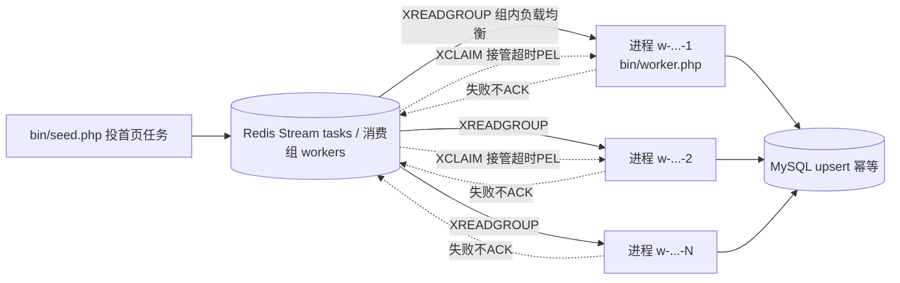

# 多进程高并发解决方案（方案一）

> 适用对象：crawl-worker-redis 采集器在「单系列串行页链」模型下，用**多进程 + 同一消费组**
> 直接换取水平并发。当前架构天然支持，本方案只做三件事：
> 进程怎么起、谁负责拉起与守护、并发上限怎么判断与调优。

---

## 一、为什么"多进程"就是正确的并发形态

任务层使用 **Redis Stream 消费组**：同组多个 consumer（进程）各读各的消息，
一条任务只会被组内一个 consumer 拿到；失败/崩溃的消息留在 PEL，超时后被其他进程
用 `XPENDING IDLE + XCLAIM` 自动接管。这是 Kafka 风格的 **at-least-once + 水平扩容**语义。



**为什么不会抓重/抓乱（现成保障）：**

| 风险 | 兜底机制 | 代码 |
| --- | --- | --- |
| 同页被两个进程同时处理 | `done_pages` 断点守卫：≤已完成页直接 ACK | `Worker::process` 开头 |
| 同系列下一页被重复投递 | `addlock:{typeId}:{page}` NX 锁（60s） | `RedisStore::tryLockNextPage` |
| 处理一半进程被杀 | 消息未 ACK → PEL 停留 → 超时 XCLAIM 接管 | `Worker::start` 步骤 1 / `claimBatch` |
| 重复落库 | MySQL `(source, model)` 唯一键 upsert | `Db::upsertModels` |
| 出口/冷却跨进程不共享 | 代理池 Redis 化，cooldown/弃用状态共享 | `ProxyPool` + `config.proxy.redis` |

> 因此并发模型上**不需要任何分布式锁/任务分片**，进程数往上加即可。
> 单进程只是"一个 consumer + 单飞阻塞 curl"，多进程 = 多个单飞并行的消费者。

---

## 二、并发上限：不是进程数，是"在途系列数 × 单进程串行吞吐"

当前页链是**同系列串行**的：页 N 成功后才投递页 N+1（见 `Worker::process` 尾部
`tryLockNextPage` + `addTask`）。所以：

```
进程内的吞吐  ≈ 1 页 / (请求耗时 + delay_ms 礼貌间隔)
集群总吞吐    ≈ 进程数 × 单进程吞吐        ← 进程只负责并行“不同系列/不同在途页”
有效并发上限  ≈ min(在途任务数, 站点可容忍速率, 代理池可用出口数, DB 写能力)
```

- 进程开得比「同时在途任务」还多没有意义（多出的进程只是空转阻塞等待）。
- 同系列页链串行 = 单个系列的吞吐锁死为约 1 页/请求周期。
  **当单系列页数很多、需要再提速时，才需要方案二（首页预投递整链/游标完成集合）。**
- 直连且站点限速 1 req/s 时，5 个进程合计 5 req/s 也会触发风控；
  此时应该加**跨进程全局限速**（见 §六），而不是无限加进程。

---

## 三、快速启动（本机/开发机，Windows 或 Linux 均可）

```bash
# 0) 前置：确保 MySQL、远程 Redis 就绪（以远程 Redis 为例）
export CW_REDIS_HOST='<redis-host>' CW_REDIS_AUTH='<redis-pass>'   # Linux
# PowerShell: $env:CW_REDIS_HOST='<redis-host>'; $env:CW_REDIS_AUTH='<redis-pass>'

# 1) 播种（每个系列只投"首页"任务，页链由 Worker 自行推进）
php bin/seed.php --types 1,3,4 --max-pages 3

# 2) 并发开 N 个常驻 Worker。
#    --name 不传时默认 w-<主机名>-<进程号>，天然全局唯一，可放心重复起
php bin/worker.php --idle-rounds 0      # 终端 1
php bin/worker.php --idle-rounds 0      # 终端 2
php bin/worker.php --idle-rounds 0      # 终端 3

# 3) 观察
php bin/stats.php --recent 5
```

PowerShell 后台一键起 N 个（用于本地压测并发）：

```powershell
1..4 | ForEach-Object {
    Start-Process php -ArgumentList 'bin/worker.php', '--idle-rounds', '0' `
        -RedirectStandardOutput "logs/mp-$_.out.log" -RedirectStandardError "logs/mp-$_.err.log"
}
```

> 注意：消费组 consumer 名是 **Redis 全局唯一**的（跨进程/跨机器）。
> `--name` 请只在确定唯一时使用；不传即用 `w-<host>-<pid>`，保证不撞名。

---

## 四、生产部署：supervisor 守护（Linux 推荐）

仓库自带示例：`deploy/supervisor/crawl-worker.conf`

```ini
[program:crawl-worker]
process_name=%(program_name)s-%(process_num)02d
command=php %(ENV_CW_HOME)s/bin/worker.php --name w-%(process_num)02d --idle-rounds 0
numprocs=8
directory=%(ENV_CW_HOME)s
autostart=true
autorestart=true
startsecs=5
stopwaitsecs=10
stopasgroup=true
killasgroup=true
environment=CW_REDIS_HOST="<redis-host>",CW_REDIS_AUTH="<redis-pass>",CW_REDIS_PREFIX="cw:shikues:"
stdout_logfile=%(ENV_CW_HOME)s/logs/supervisor-worker.log
stderr_logfile=%(ENV_CW_HOME)s/logs/supervisor-worker-err.log
```

```bash
# 使用
supervisorctl reread && supervisorctl update
supervisorctl status crawl-worker:*        # 8 个进程全 RUNNING
supervisorctl restart crawl-worker:*
```

- `numprocs` = 想并行消费的进程数，先小后大，结合 §二/§六 判断。
- **每个 worker 一份 stdout 日志即可**；`Worker` 内部日志还会按 consumer 各自追加
  `logs/worker.log`（`LOCK_EX` 原子追加，多进程不串行）。
- supervisor 拉起进程后，进程第一步会先 `XCLAIM` 接管历史 PEL 超时消息，
  崩溃遗留任务自动续跑，无需人工介入。
- `stopwaitsecs` 给足优雅退出时间（§五）。

systemd 形态同理：一个 template unit `crawl-worker@.service`，
`[email protected]` 启动，`Restart=always`，`ExecStop`/SIGTERM 由 §五 优雅退出兜住。

---

## 五、优雅退出（SIGTERM/SIGINT）

常驻进程被 supervisor/systemd stop 或手动 `kill` 时，应**把手头页处理完再停**，
避免"落库一半、ACK 前被杀"产生的无谓重抓（虽然幂等兜底，但能少则少）。

实现（`src/Worker.php`）：

- `pcntl` 可用（Linux）时注册 `SIGTERM`/`SIGINT` → 置停止位；
- 主循环每轮结束检查停止位，先退出接管与阻塞读，打印最终状态后正常收尾；
- Windows 无 `pcntl` 自动跳过，进程仍可用 `idle-rounds` 或直接结束
  （幂等机制保证重抓无副作用）。

```bash
kill -TERM <pid>          # 优雅：当前页完成后退出
kill -TERM -<pgrp>        # supervisor 停整组
```

---

## 六、全局限速：多进程合计不超过站点/代理阈值

每进程的 `CW_DELAY_MS=200`（`Http.delay_ms`）只是"本进程内"礼貌间隔，
N 进程合计速率 = N × 单进程速率。若站点/出口对总速率敏感，应加**Redis 分布式限速闸门**：

```php
// 伪代码：请求前拿令牌（Redis INCR + EXPIRE 滑动窗口，跨进程共享）
private function throttle(string $bucket, int $maxPerSec): void
{
    $key = 'rl:' . $bucket . ':' . intdiv(time(), 1); // 每秒一个桶
    $n   = $this->r->incr($key);
    if ($n === 1) {
        $this->r->expire($key, 2);
    }
    while ($n > $maxPerSec) {          // 超限则本进程自旋等待下一秒
        usleep((int)ceil(1000000 / $maxPerSec));
        $n = $this->r->incr($key);
    }
}
```

配套**熔断**（出现风控时全局降速，而不是继续撞墙）：

- 403 / 风控 HTML：已按出口标记冷却（`ProxyPool` 归因 A/B/C）；
- 连续全出口 403：额外置 `rl:global:pause=1`（EX 60s），所有进程 `sleep` 1s 再试。

---

## 七、参数调优速查

| 参数 | 默认 | 调优建议 |
| --- | --- | --- |
| 进程数（numprocs） | 1 | 从在途任务数/目标速率反推，先小后大 |
| `--name` | `w-<host>-<pid>` | 集群内全局唯一即可，一般不用传 |
| `claim_idle`（`CW_CLAIM_IDLE_MS`） | 30000 | **远程 Redis 建议 ≥60s**；> 单页最坏耗时 × 重试 |
| `worker.batch` | 5 | 进程数多时保持小批量，避免单轮拉太多挤占他进程 |
| `worker.block_sec` | 5 | 常驻可保持 5s；要退出更灵敏可调小 |
| `CW_DELAY_MS` | 200 | 分布式限速的补充，见 §六 |
| `seed.max_pages` | 3 | 演示限速；真实采集按需放开 |
| `http.retries`/超时 | 2/20s | 调大时同步放大 `claim_idle` |
| Redis `MAXLEN ~5000` | 内置 | 任务流自动裁剪，无需维护 |

---

## 八、验证与监控

- **任务层**：`php bin/stats.php` → `stream_len / pending(PEL) / dead_letters /
  page_done / page_fail / rows_upsert`。
- **PEL 看谁在拖**（Redis 命令）：
  ```
  XPENDING cw:shikues:tasks workers            # 各 consumer 未确认消息分布
  XPENDING cw:shikues:tasks workers IDLE 60000 - + 20   # 谁有超过阈值的失联任务
  ```
  若某 consumer PEL 持续堆积而别的空闲 → 该进程卡死/太慢，重启或调参数。
- **回归**：`php tests/smoke.php` 覆盖多进程核心语义（B 段消费组/接管/幂等、D 段断点），
  改并发相关代码后先跑一遍。
- 并发压测：§三 PowerShell 一键起 4~8 个进程 + `stats.php` 观察 `page_done` 是否线性增长。

---

## 九、什么时候升级到"方案二/方案三"

- 单系列页数多、需要**系列内并行** → 首页后预投递整条链 + 游标改为"完成页集合"；
- 任务量到十万页级、担心单 Stream key 争用 → 按 `type_id % N` 分片多流
  （封装在 `RedisStore` 内部，调用方不变）；
- 进程数受容器限制、必须单进程高并发 IO → 再考虑 Swoole 协程重写 Http 层
  （收益/成本需重新评估，不默认推荐）。

---

## 十、本仓库的落地改动（配合本方案）

1. `bin/worker.php`：不传 `--name` 时默认 `w-<主机名>-<pid>`，全局唯一，杜绝多进程撞名；
2. `src/Worker.php`：注册 `SIGTERM/SIGINT` 优雅退出（pcntl 可用时），主循环轮末检查停止位；
3. 新增 `deploy/supervisor/crawl-worker.conf`：supervisor 一键托管 N 进程示例；
4. 本文件：`多进程高并发解决方案.md`。

> 验证基线：远程 Redis 6.2 + 本机 MySQL，`tests/smoke.php` 全量 A~E 通过（80/80）。
